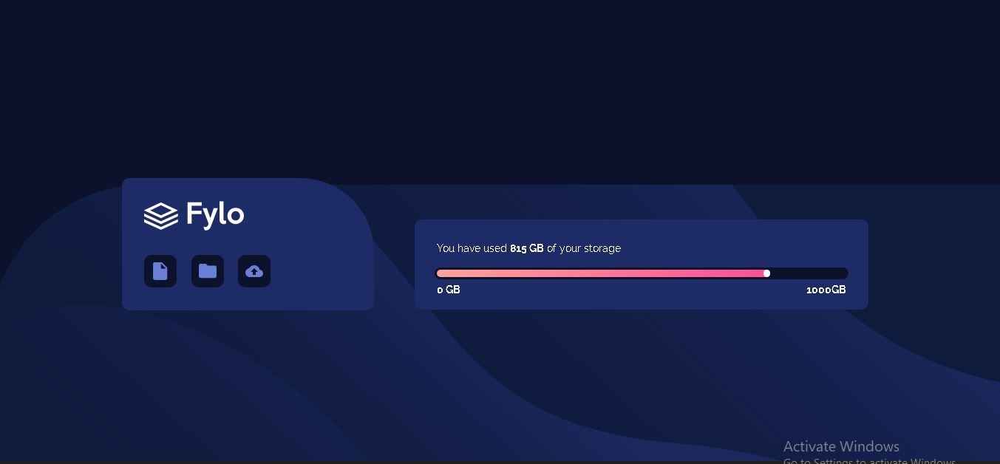

# Frontend Mentor - Fylo data storage component solution

This is a solution to the [Fylo data storage component challenge on Frontend Mentor](https://www.frontendmentor.io/challenges/fylo-data-storage-component-1dZPRbV5n). Frontend Mentor challenges help you improve your coding skills by building realistic projects. 

## Table of contents

- [Overview](#overview)
  - [The challenge](#the-challenge)
  - [Screenshot](#screenshot)
  - [Links](#links)
  - [Built with](#built-with)
  - [What I learned](#what-i-learned)
  - [Useful resources](#useful-resources)
- [Author](#author)
- [Acknowledgments](#acknowledgments)


## Overview

### The challenge

Users should be able to:

- View the optimal layout for the site depending on their device's screen size

### Screenshot




### Links

- Solution URL: [https://github.com/Marvel123g/flyo-data-storage.git]
- Live Site URL: [https://marvel123g.github.io/flyo-data-storage/]

### Built with

- Semantic HTML5 markup
- CSS custom properties

**Note: These are just examples. Delete this note and replace the list above with your own choices**

### What I learned

Use this section to recap over some of your major learnings while working through this project. Writing these out and providing code samples of areas you want to highlight is a great way to reinforce your own knowledge.

To see how you can add code snippets, see below:

```html
how to use more html tags
```
```css
.bar .insidebar{
    background-image: linear-gradient(to right, hsl(6, 100%, 80%), hsl(335, 100%, 65%));
    justify-content: flex-end;
}

### Useful resources

- [Youtube]- This helped me width the styling and the positioning of everything.

## Author

- Website - [Marvelous]([https://marvel123g.github.io/flyo-data-storage/]
- Frontend Mentor - [@Marvel123g](https://www.frontendmentor.io/profile/Marvel123g)
- Instagram - [@ma.rvellous971]


## Acknowledgments

This is where you can give a hat tip to anyone who helped you out on this project. Perhaps you worked in a team or got some inspiration from someone else's solution. This is the perfect place to give them some credit.
